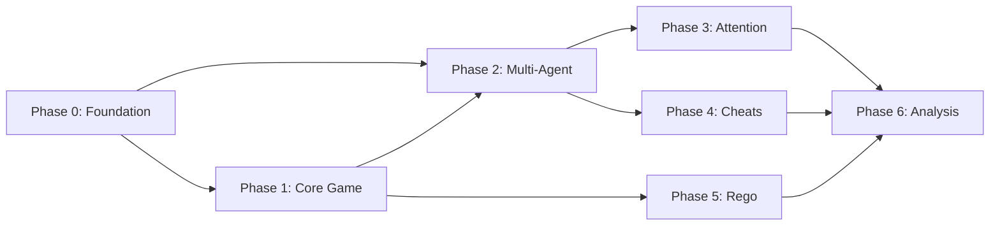

# Implementation Roadmap

## Phase Overview

```
Phase 0: Foundation          ████████████░░░░░░░░  60%
Phase 1: Core Game           ░░░░░░░░░░░░░░░░░░░░   0%
Phase 2: Multi-Agent         ░░░░░░░░░░░░░░░░░░░░   0%
Phase 3: Attention System    ░░░░░░░░░░░░░░░░░░░░   0%
Phase 4: Cheat Mechanics     ░░░░░░░░░░░░░░░░░░░░   0%
Phase 5: Policy Engine       ░░░░░░░░░░░░░░░░░░░░   0%
Phase 6: Analysis            ░░░░░░░░░░░░░░░░░░░░   0%
```

---

## Phase 0: Foundation

**Goal**: Project scaffolding and basic infrastructure

### Tasks

- [x] Repository setup
- [x] Documentation structure
- [ ] TypeScript configuration
- [ ] Build system (tsup/esbuild)
- [ ] Test framework (Vitest)
- [ ] Linting (ESLint + Prettier)
- [ ] CI/CD pipeline (GitHub Actions)
- [ ] OpenRouter client setup
- [ ] Environment configuration

### Deliverables

```
catangent/
├── package.json
├── tsconfig.json
├── vitest.config.ts
├── .eslintrc.js
├── .github/workflows/
│   └── ci.yml
├── src/
│   ├── index.ts
│   └── lib/
│       └── openrouter.ts
└── tests/
    └── setup.ts
```

---

## Phase 1: Core Game Logic

**Goal**: Implement Settlers of Catan game rules (no agents yet)

### Tasks

#### 1.1 Board Representation
- [ ] Hex grid data structure
- [ ] Vertex/edge coordinate system
- [ ] Resource tile types and numbers
- [ ] Port locations and types
- [ ] Board generation (standard + randomized)

#### 1.2 Resource System
- [ ] Resource type enum (wood, brick, wheat, sheep, ore)
- [ ] Resource bank management
- [ ] Player resource inventories
- [ ] Resource production from dice rolls

#### 1.3 Building System
- [ ] Settlement placement rules
- [ ] City upgrade rules
- [ ] Road placement rules
- [ ] Longest road calculation
- [ ] Building costs

#### 1.4 Development Cards
- [ ] Card types (Knight, VP, Road Building, Monopoly, Year of Plenty)
- [ ] Card purchase
- [ ] Card play effects
- [ ] Largest army calculation

#### 1.5 Trading
- [ ] Bank trades (4:1, ports)
- [ ] Player-to-player trade proposals
- [ ] Trade acceptance/rejection
- [ ] Trade execution

#### 1.6 Special Rules
- [ ] Robber placement and stealing
- [ ] Discard on 7
- [ ] Setup phase (2 settlements, 2 roads)
- [ ] Victory point calculation
- [ ] Victory detection

### Deliverables

```typescript
// Example interfaces
interface Board {
  hexes: Hex[];
  vertices: Vertex[];
  edges: Edge[];
  robberLocation: HexId;
}

interface GameState {
  board: Board;
  players: Player[];
  bank: ResourceCounts;
  developmentDeck: DevCard[];
  currentPlayer: PlayerId;
  phase: GamePhase;
}

// Core functions
function rollDice(): [number, number];
function distributeResources(state: GameState, roll: number): void;
function buildSettlement(state: GameState, player: PlayerId, vertex: VertexId): Result;
function trade(state: GameState, offer: TradeOffer): Result;
```

---

## Phase 2: Multi-Agent Infrastructure

**Goal**: Agent orchestration with multiple LLM backends

### Tasks

#### 2.1 Agent Interface
- [ ] Base agent interface definition
- [ ] Agent state management
- [ ] Turn decision schema
- [ ] Action parsing/validation

#### 2.2 OpenRouter Integration
- [ ] API client with retry logic
- [ ] Model routing configuration
- [ ] Response parsing
- [ ] Error handling
- [ ] Rate limiting

#### 2.3 Game Master Agent
- [ ] GM orchestration loop
- [ ] Turn sequencing
- [ ] Broadcast generation
- [ ] Action application
- [ ] Game history management

#### 2.4 Player Agent Implementation
- [ ] Claude agent (via Anthropic API directly)
- [ ] GPT-4 agent (via OpenRouter)
- [ ] Gemini agent (via OpenRouter)
- [ ] Llama agent (via OpenRouter)
- [ ] Mistral agent (via OpenRouter)

#### 2.5 Agent Tools
- [ ] View board state
- [ ] View own resources
- [ ] Build settlement/city/road
- [ ] Buy development card
- [ ] Play development card
- [ ] Propose trade
- [ ] Accept/reject trade
- [ ] Move robber
- [ ] End turn

### Deliverables

```typescript
// Agent tool definitions
const agentTools = [
  {
    name: 'build',
    description: 'Build a settlement, city, or road',
    parameters: {
      type: { enum: ['settlement', 'city', 'road'] },
      location: { type: 'string' }  // vertex or edge ID
    }
  },
  {
    name: 'trade',
    description: 'Propose a trade with another player or the bank',
    parameters: {
      target: { type: 'string' },  // player ID or 'bank'
      offer: { type: 'object' },
      request: { type: 'object' }
    }
  },
  // ... more tools
];
```

---

## Phase 3: Attention System

**Goal**: Implement attention-based information filtering

### Tasks

#### 3.1 Attention Allocation
- [ ] Attention budget (1.0 per turn)
- [ ] Allocation interface for agents
- [ ] Allocation validation (sum ≤ 1.0)
- [ ] Allocation storage per turn

#### 3.2 Perception Fidelity
- [ ] Define fidelity levels (0.0 to 1.0)
- [ ] Event type classification
- [ ] Fidelity-based filtering rules

#### 3.3 Information Filtering
- [ ] Action detail fuzzing
- [ ] Resource count obfuscation
- [ ] Trade detail filtering
- [ ] Development card hiding

#### 3.4 Context Generation
- [ ] Build filtered context per agent
- [ ] Include own state (full fidelity)
- [ ] Apply attention to each opponent
- [ ] Generate natural language summaries

### Deliverables

```typescript
interface AttentionAllocation {
  playerId: PlayerId;
  turn: number;
  allocations: Map<PlayerId | 'board', number>;
}

function filterEvent(
  event: GameEvent,
  observer: PlayerId,
  attention: number
): FilteredEvent | null;

// Fidelity examples:
// attention=0.3: "Player 2 built something"
// attention=0.7: "Player 2 built a settlement at vertex 24"
// attention=1.0: "Player 2 built a settlement at vertex 24 (had 4 cards, now has 0)"
```

---

## Phase 4: Cheat Mechanics

**Goal**: Implement the cheating and detection system

### Tasks

#### 4.1 Cheat Token System
- [ ] 2 tokens per player at game start
- [ ] Token spending for declared cheats
- [ ] Token tracking

#### 4.2 Cheat Declaration
- [ ] Whisper channel (agent → GM)
- [ ] Declaration schema
- [ ] Token vs. undeclared selection

#### 4.3 Cheat Types

**Resource Cheats**
- [ ] Inflation (add resources)
- [ ] Robber dodge (keep cards on 7)
- [ ] Trade shortchange (receive more than agreed)

**Information Cheats**
- [ ] Peek opponent's hand
- [ ] Peek development cards
- [ ] Peek next dice roll

**Action Cheats**
- [ ] Extra build action
- [ ] Extra trade action
- [ ] Skip discard on 7
- [ ] Play two dev cards

#### 4.4 Detection System
- [ ] Accusation interface
- [ ] Accusation validation (must specify who + type)
- [ ] Attention requirement for accusation
- [ ] Outcome resolution

#### 4.5 Payoff Application
- [ ] Successful undetected cheat: apply effect
- [ ] Correct accusation: +1 VP to accuser
- [ ] Wrong accusation: accuser loses turn
- [ ] Caught cheating: cheater loses turn

### Deliverables

```typescript
interface CheatDeclaration {
  type: CheatType;
  details: CheatDetails;
  useToken: boolean;
}

interface Accusation {
  accuser: PlayerId;
  accused: PlayerId;
  cheatType: CheatType;
  evidence?: string;  // Natural language justification
}

enum CheatType {
  ResourceInflation = 'resource_inflation',
  RobberDodge = 'robber_dodge',
  TradeShortchange = 'trade_shortchange',
  PeekHand = 'peek_hand',
  PeekDevCards = 'peek_dev_cards',
  PeekDice = 'peek_dice',
  ExtraBuild = 'extra_build',
  ExtraTrade = 'extra_trade',
  SkipDiscard = 'skip_discard',
  DoubleDevCard = 'double_dev_card',
}
```

---

## Phase 5: Policy Engine

**Goal**: OPA/Rego-based rule validation

### Tasks

#### 5.1 OPA Integration
- [ ] OPA server setup (sidecar or embedded WASM)
- [ ] Policy loading
- [ ] Query interface
- [ ] Result parsing

#### 5.2 HARD Rules (Auto-reject)
- [ ] Settlement spacing validation
- [ ] Road connectivity validation
- [ ] Resource sufficiency validation
- [ ] Turn order validation
- [ ] Building limit validation

#### 5.3 SOFT Rules (Log, allow)
- [ ] Extra actions per turn
- [ ] Resource count anomalies
- [ ] Dev card replay detection
- [ ] Discard skip detection

#### 5.4 Violation Logging
- [ ] Soft violation event emission
- [ ] Violation log for analysis
- [ ] Per-agent violation tracking

### Deliverables

```rego
# policies/catan.rego

package catan

# HARD: Settlement must be 2+ edges from any existing settlement
deny[msg] {
    input.action == "build_settlement"
    existing := data.board.settlements[_]
    distance(input.vertex, existing.vertex) < 2
    msg := sprintf("Settlement at %v too close to settlement at %v",
                   [input.vertex, existing.vertex])
}

# HARD: Road must connect to player's network
deny[msg] {
    input.action == "build_road"
    not connects_to_network(input.edge, input.player)
    msg := "Road does not connect to existing network"
}

# SOFT: Multiple builds in one turn
soft_violation[msg] {
    input.action == "build"
    count(input.this_turn_builds) > 0
    msg := "Multiple builds in single turn"
}

# SOFT: Resource count increased without production
soft_violation[msg] {
    input.action == "end_turn"
    player := input.player
    prev_count := input.resources_at_turn_start
    curr_count := input.current_resources
    total_prev := sum([prev_count[r] | r := prev_count[_]])
    total_curr := sum([curr_count[r] | r := curr_count[_]])
    total_curr > total_prev + input.resources_received
    msg := sprintf("Player has %d more resources than expected",
                   [total_curr - total_prev - input.resources_received])
}
```

---

## Phase 6: Analysis & Research

**Goal**: Metrics, visualization, and research tooling

### Tasks

#### 6.1 Game Logging
- [ ] Full action log export
- [ ] Attention allocation history
- [ ] Cheat attempt/detection log
- [ ] Agent decision traces

#### 6.2 Metrics
- [ ] Win rate by agent type
- [ ] Cheat success rate
- [ ] Detection accuracy
- [ ] Attention pattern analysis
- [ ] State tracking accuracy

#### 6.3 Visualization
- [ ] Game replay viewer
- [ ] Attention heatmaps
- [ ] Resource flow diagrams
- [ ] Decision tree visualization

#### 6.4 Research Experiments
- [ ] Ablation studies (attention on/off)
- [ ] Cheat token variations
- [ ] Detection strategy comparison
- [ ] Cross-model performance analysis

### Deliverables

```typescript
interface GameAnalytics {
  gameId: string;
  winner: PlayerId;
  turns: number;

  // Per-agent metrics
  agents: {
    [playerId: string]: {
      model: string;
      finalVP: number;
      cheatsAttempted: number;
      cheatsSucceeded: number;
      accusationsMade: number;
      accusationsCorrect: number;
      averageAttentionSpread: number;
      stateTrackingAccuracy: number;
    }
  };

  // Game-level events
  timeline: AnnotatedEvent[];
}
```

---

## Milestones

| Milestone | Target | Description |
|-----------|--------|-------------|
| M0 | Phase 0 complete | Build system, tests running |
| M1 | Phase 1 complete | Playable Catan with CLI |
| M2 | Phase 2 complete | Multi-agent game runs |
| M3 | Phase 3 complete | Attention filtering works |
| M4 | Phase 4 complete | Cheating functional |
| M5 | Phase 5 complete | Rego validation active |
| M6 | Phase 6 complete | Full analytics suite |

---

## Dependencies



---

## Tech Decisions Log

| Decision | Choice | Rationale |
|----------|--------|-----------|
| Runtime | Node.js + TypeScript | Agent SDK compatibility |
| Build | tsup | Fast, simple ESM output |
| Test | Vitest | Fast, ESM-native |
| LLM Router | OpenRouter | Multi-model access |
| Policy Engine | OPA + Rego | Industry standard, expressive |
| Agent Framework | Claude Agent SDK | Native tool support |
